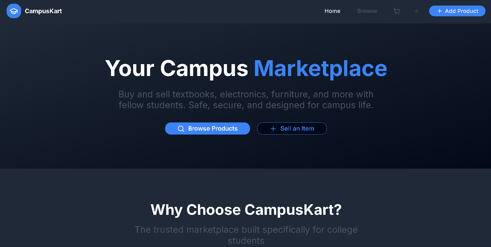
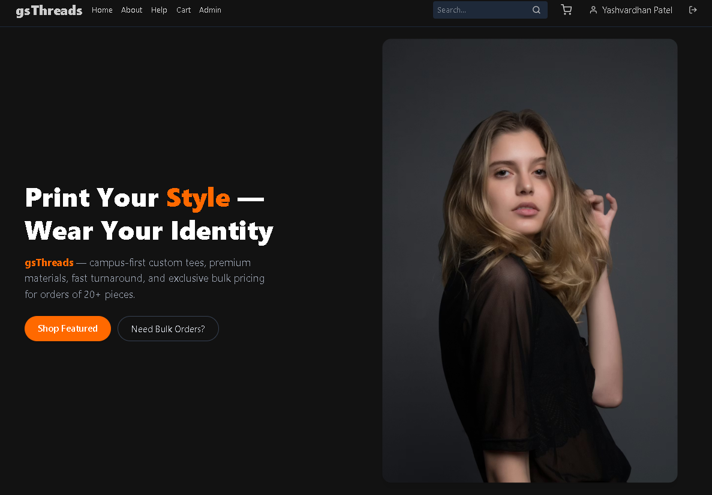

<!-- ========================= HEADER ========================= -->

  

  

<h2 align="center">👋 Hi, I'm Yashvardhan Patel</h2>

  <b>Building products that solve real problems.</b> 
  MERN • TypeScript • Open Source • Product Thinking

  
  

---

<h3 align="center">
Full-Stack Developer | B.Tech Undergraduate at <b>SGSITS, Indore</b>
</h3>

I enjoy building scalable web applications, exploring modern technologies, and solving problems through code. I believe the best way to learn is by building real projects, continuously improving, and sharing what I create.

---

## 🛠️ Tech Stack

  

---

## 💻 What I'm Working On

- 🤖 Learning **AI/ML** and exploring its real-world applications
- 🤝 Contributing to collaborative development projects
- 💼 Working as a **Software Development Intern**
- 📚 Improving my skills in **System Design** and scalable application development

---

## 🚀 Featured Projects

---

## 📸 Project Preview

  
  

---

## 👾 Pacman Contribution Graph

  

---

## 📊 GitHub Summary

---

## 📈 GitHub Stats

---

## 📉 Activity Graph

---

---

  <b>⚔️ "The only way to win is to fight. The only way to grow is to build."</b>

---

## 📫 Connect With Me

<a href="https://www.linkedin.com/in/yashvardhan-patel1710/">LinkedIn</a> •
<a href="mailto:yashvardhan.patel007@gmail.com">Email</a> •
<a href="https://yashhh-017.github.io/Resume/">Resume</a>

---

